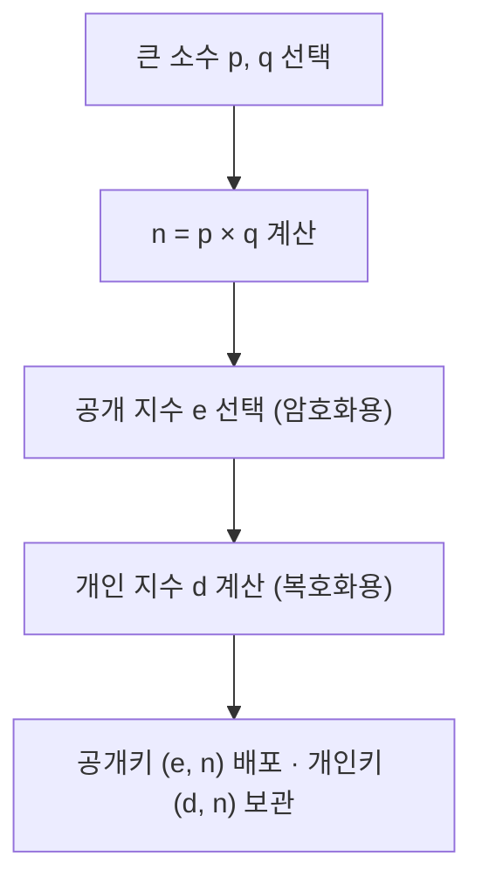
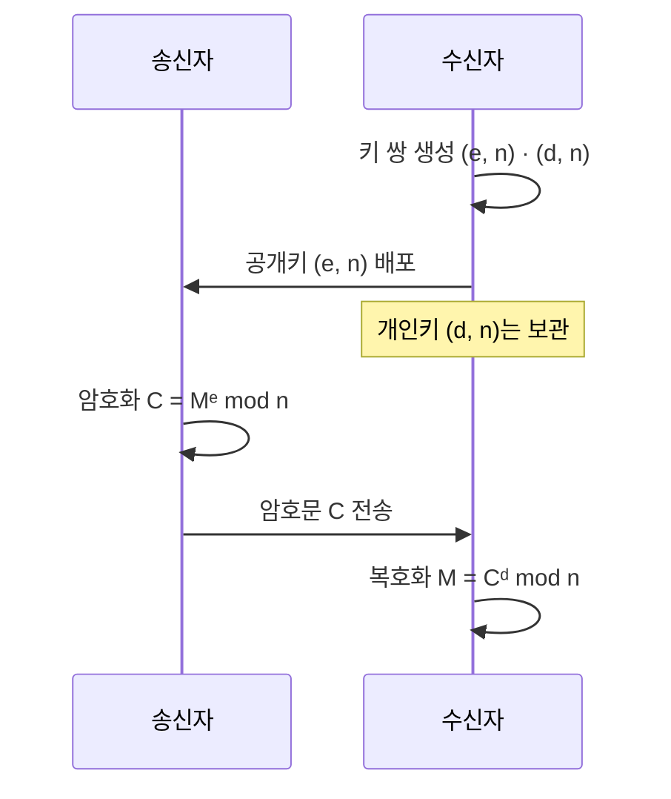

# 비대칭키 암호화 구현 방식 - RSA

> - 비대칭키는 공개키·개인키 한 쌍을 쓰며, 한 키로 암호화한 데이터는 짝이 되는 다른 키로만 복호화됨
> - 그 한 쌍을 만드는 대표적인 방식이 RSA이며, 큰 수의 소인수분해가 어렵다는 점에 안전성을 둠

## RSA란

비대칭키 암호화 방식은 공개된 공개키만으로는 짝이 되는 개인키를 현실적인 시간 안에 계산할 수 없어야 하는 특징을 이용한다.

| 구현 방식 |    안전성의 근거     |           특징            |
|:-----:|:--------------:|:-----------------------:|
|  RSA  | 큰 수의 소인수분해 난해성 |    가장 널리 쓰이며 구조가 직관적    |
|  ECC  | 타원곡선 이산로그 난해성  | 더 짧은 키로 동등한 보안, 모바일에 적합 |

이 중 RSA는 큰 두 소수를 곱하기는 쉽지만 그 곱을 다시 두 소수로 되돌리기는 어렵다는 성질을 이용한다.

- 공개값에 두 소수의 곱 n이 들어가지만, n을 소인수분해하지 못하면 개인키를 복원할 수 없음
- 키 길이는 곧 n의 비트 수이며, 현재는 2048비트 이상을 표준으로 사용
- 연산이 무거워 본문 암호화보다 TLS 키 교환, 전자서명처럼 짧은 데이터에 주로 사용

## 키 생성

큰 소수 두 개를 골라 공개키와 개인키를 한 번에 만든다.



각 값이 맡는 역할은 다음과 같다.

- 큰 소수 p, q: 곱 n에서 다시 p·q를 되찾기 어렵다는 점이 RSA의 보안 근거
- 모듈러스 n: `n = p × q`로 만든 값이며, 모든 연산이 이 n을 기준으로 `mod n` 순환
- 공개 지수 e: 보통 65537을 사용 — 거듭제곱이 빠르면서 보안상 약점이 적음
- 개인 지수 d: `e × d`를 `(p-1) * (q-1)`로 나눈 나머지가 1이 되도록 맞춰 계산한 값

## 암호화와 복호화

암호화와 복호화는 모두 거듭제곱한 뒤 n으로 나눈 나머지를 취하는 같은 형태의 연산이다.

| 단계  |      하는 일      |      수식      |
|:---:|:--------------:|:------------:|
| 암호화 | 평문 M을 e번 거듭제곱  | C = Mᵉ mod n |
| 복호화 | 암호문 C를 d번 거듭제곱 | M = Cᵈ mod n |

핵심은 공개키 (e, n)로 암호화하면 개인키의 d 없이는 되돌릴 수 없다는 점이다.

## 전체 통신 흐름

RSA 통신은 수신자가 키를 만들어 공개키만 내보내고, 송신자가 그 공개키로 암호화해 보내는 한 방향으로 흐른다.



- 공개키는 노출돼도 무방, 복호화에 필요한 d는 수신자만 보유
- 중간에서 암호문 C와 공개키 (e, n)을 모두 가로채도 원문 M은 복원 불가

## 왜 다시 원문으로 돌아오는가

복호화로 원문이 되돌아오는 건 e와 d를 서로 역연산이 되도록 짝지어 두기 때문이다.

- 암호화·복호화를 거치면 지수가 `e × d`로 합쳐짐
- d는 `e × d`가 `(p-1)(q-1)`의 배수보다 1 큰 값이 되도록 계산한 값
- 오일러 정리에 따라 mod n에서 그 배수 부분은 1로 사라지고, 결국 `M^1 = M`만 남음

## 작은 수 예시

실제 RSA는 수백 자리 숫자를 쓰지만, 작은 수로 옮기면 과정은 다음과 같다.

```text
[키 생성]
1. 두 소수 선택: p = 3, q = 11
2. n 계산: n = 3 × 11 = 33
3. 기준값 계산: (3-1) × (11-1) = 20
4. 공개 지수 e 선택: 20과 서로소인 7 선택        → 공개키 (7, 33)
5. 개인 지수 d 계산: (7 × d) mod 20 = 1 을 만족하는 d
   d = 3 → 7 × 3 = 21, 21 mod 20 = 1          → 개인키 (3, 33)

[통신]
평문 M = 4
암호화: C = 4^7  mod 33 = 16384 mod 33 = 16
복호화: M = 16^3 mod 33 = 4096  mod 33 = 4   ✓ 원문 복구
```
