# 대칭키 암호화와 비대칭키 암호화

> - 대칭키: 암호화와 복호화에 '동일한 단 하나의 키'를 사용한다. 빠르지만 키를 안전하게 전달하기 어렵다.
> - 비대칭키: 암호화와 복호화에 '공개키·개인키 쌍'을 사용한다. 안전하지만 속도가 느리다.
> - 하이브리드(실무): 두 방식을 결합해, 비대칭키로 '대칭키(세션키)'를 안전하게 교환하고, 실제 데이터 본문은 교환된 대칭키로 빠르게 암호화하여 통신한다.

## 대칭키 암호화

하나의 비밀키로 암호화와 복호화를 모두 수행하는 방식이다.

- 예: AES, ChaCha20
- 연산이 단순해 빠르고, 대용량 데이터에 적합
- 키 배송 문제: 송신자와 수신자가 반드시 '동일한 키'를 가지고 있어야 통신이 성립
    - 키를 인터넷을 통해 상대방에게 전달할 때 해커에게 탈취당할 위험 존재

## 비대칭키 암호화

공개키·개인키 쌍을 쓰며, 한 키로 잠그면 짝인 다른 키로만 풀 수 있다.

- 예: RSA, ECC
- 키 전달 문제 해결: 누구나 볼 수 있게 공개키를 배포하고, 개인키는 자신만 안전하게 보관
- 약점: 연산이 무거워 대칭키보다 수백~수천 배 느리고, 키 길이도 길어 대용량 데이터에는 부적합

## 꼬리 질문 - 각각의 장단점

|     구분      |          대칭키           |       비대칭키       |
|:-----------:|:----------------------:|:----------------:|
|      키      |       단일 공유 비밀키        |   공개키 + 개인키 쌍    |
|     속도      |           빠름           |   느림 (수백~수천 배)   |
|   키 배송 문제   |   있음 (안전한 전달 채널 필요)    | 없음 (공개키는 공개해도 됨) |
| 참여자 N명의 키 수 | `N(N-1)/2`개 (쌍마다 키 필요) |  `N`쌍 (각자 1쌍씩)   |
|    주 용도     |       대용량 본문 암호화       |    키 교환·신원 인증    |

## 하이브리드 방식

두 방식의 장점만 취하는 것이 하이브리드 암호화이며, HTTPS의 TLS가 대표적이다.

```mermaid
sequenceDiagram
    participant C as 클라이언트 (브라우저)
    participant S as 서버 (웹사이트)

    rect rgb(0, 0, 0)
        Note over C, S: [1단계] 핸드셰이크: 비대칭키를 이용한 안전한 통신 준비
        C->>S: 1. 접속 요청 (Client Hello)
        S->>C: 2. 서버 인증서 (공개키 포함) 및 키 교환 매개변수 전달
        C->>C: 3. 인증서 검증 및 임시 '대칭키(세션키)' 합의
        C->>S: 4. 세션키 합의 완료 통보
    end

    rect rgb(0, 0, 0)
        Note over C, S: [2단계] 데이터 전송: 대칭키를 이용한 암호화 통신
        C->>S: 5. 합의된 대칭키(AES 등)로 암호화된 실제 요청(HTTP) 전송
        S->>C: 6. 대칭키로 복호화 후, 암호화된 결과 응답
    end
```

1. 키 교환 단계
    - 비대칭키를 이용해 대칭키(세션키)를 안전하게 합의
    - 키 배송 문제를 비대칭키로 해결
2. 데이터 전송 단계
    - 합의된 대칭키로 실제 트래픽을 빠르게 암호화
    - 속도 문제를 대칭키로 해결

이렇게 비대칭키의 안전한 키 교환과 대칭키의 속도를 함께 얻는다.
